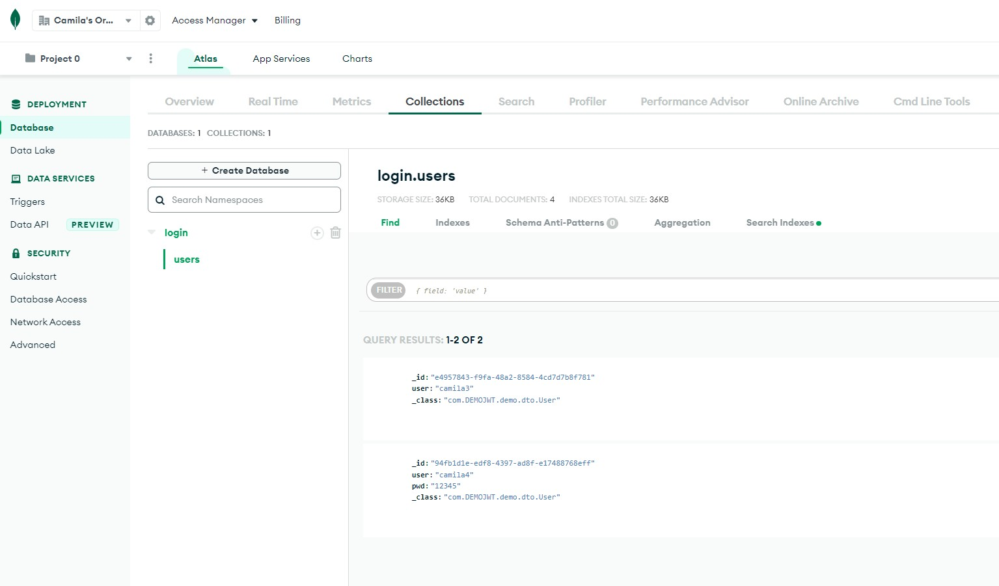
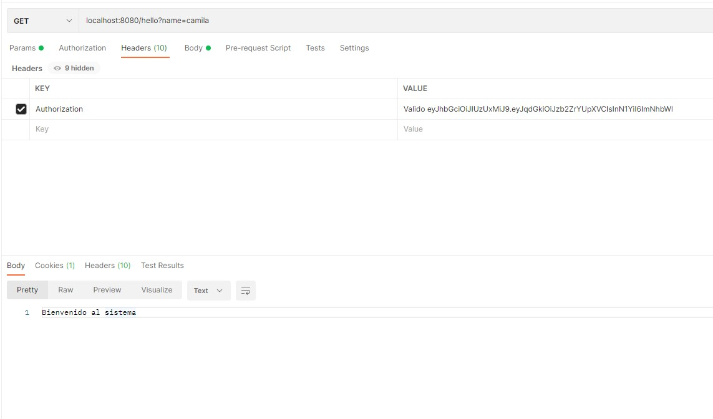

# Actividad 1 | spring boot security

### Base de datos mongodb, usuarios existentes en base de datos.

### Obtener usuario por medio de sus credenciales

### Se verifica cuando las credenciales no existen

### Login

